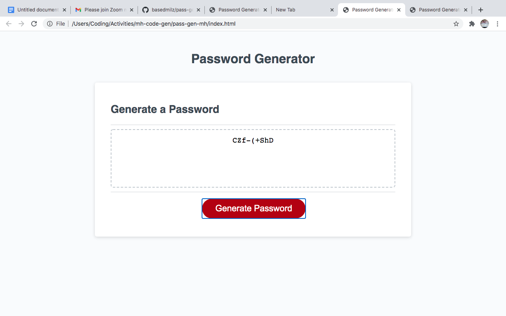

# PASSWORD GENERATOR

This is a webpage that password generator application created to keep your information confidential for a safe login experience.

On inputting attributes that you would like your password to contain , my application will print out a unique/randomized password you can you for confidentiality when creating a account.

The motivation behind this project is to create passwords that are randomized to create safer experiences as well as showcase my skill as a web developer. As I work on this project I learned different html tags and javascript formulas to show different results.

See deployed site here: [Deployed Site](https://basedmilz.github.io/pass-gen-mh/)

See repository here: [GitHub Repo](https://github.com/basedmilz/pass-gen-mh)

